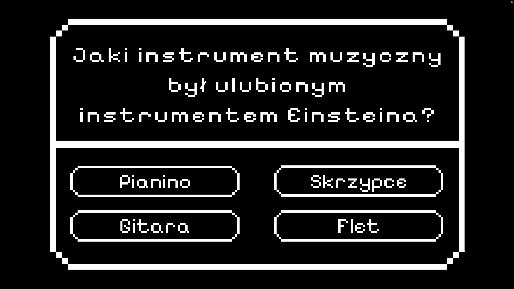

# **_O grze!_**

## Czas na odkrywanie nieznanych horyzontów i stawienie czoła wyzwaniom, jakich świat jeszcze nie widział!
  
 Wciel się w rolę nieustraszonego podróżnika, którego przygoda zaczyna się od awarii wehikułu czasu, wysyłając go w nieznane rejony czasoprzestrzeni. Zadania wybitnych naukowców oraz tajemnice skrywające się w odległych epokach stoją na drodze powrotu do domu. Czy potrafisz przetrwać w nieznanych odmętach wszechświata, odkrywając sekrety, które zmienią Twoje postrzeganie rzeczywistości? Przeżyj emocjonującą podróż w poszukiwaniu drogi powrotnej, zanurzając się w pełnych niebezpieczeństw światach, gdzie każdy krok może być kluczem do ocalenia lub zguby. 

# **_Mini Gry!_**
  ### Stephen Hawking
   Spróbuj swoich matematycznych sił wraz z Stephenem Hawkingiem!  W tej nietypowej przygodzie matematycznej wspólnie z legendarnym uczonym wyruszysz w podróż przez kosmiczną strefę nauki i liczb.
      

  ### Albert Einstein
  Czy jesteś gotowy, aby zgłębić tajemnice życia i pracy tego wybitnego fizyka?  
  Jeżeli tak, to poddaj się sprawdzeniu twojej wiedzy w quizie o niezwykłym fizyku Albercie Einsteinie! 
    

  
  ### Isaac Newton
    
  
