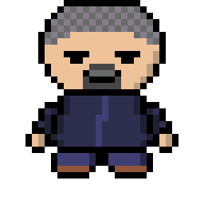

# **_O grze!_**

## Trailer

### Czas na odkrywanie nieznanych horyzontów i stawienie czoła wyzwaniom, jakich świat jeszcze nie widział!
  
Wciel się w rolę nieustraszonego podróżnika, którego przygoda zaczyna się od awarii wehikułu czasu, wysyłając go w nieznane rejony czasoprzestrzeni. Zadania wybitnych naukowców oraz tajemnice skrywające się w odległych epokach stoją na drodze powrotu do domu. Czy potrafisz przetrwać w nieznanych odmętach wszechświata, odkrywając sekrety, które zmienią Twoje postrzeganie rzeczywistości? Przeżyj emocjonującą podróż w poszukiwaniu drogi powrotnej, zanurzając się w pełnych niebezpieczeństw światach, gdzie każdy krok może być kluczem do ocalenia lub zguby. 

# **_Mini gry i postacie!_**

  ### Stephen Hawking 
  
  
Spróbuj swoich matematycznych sił wraz z Stephenem Hawkingiem! W tej nietypowej matematycznej przygodzie wspólnie z legendarnym uczonym wyruszysz w podróż przez kosmiczną sferę 
liczb.
      

  ### Albert Einstein 
  
  
  Czy jesteś gotowy, aby zagłębić się w tajemnice życia i pracy tego wybitnego fizyka?  
  Jeżeli tak, to poddaj się sprawdzeniu twojej wiedzy w quizie o niezwykłym fizyku Albercie Einsteinie! 
    

  
  ### Isaac Newton 
  
  
Wciel się w rolę samego Isaaca Newtona w tej ekscytującej przygodzie zbierania jabłek. Podążaj śladami wielkiego naukowca, który odkrył grawitację i zanurz się w fascynującym świecie, gdzie grawitacja rządzi wszystkim. Przeplatając się między gałęziami jabłoni, zbieraj jak najwięcej owoców, unikając przeszkód w postaci robaczywych jabłek.

  

  ### Nikola Tesla 
  
  
  Podejmij wyzwanie inżynieryjne oraz sprawdź swoje umiejętności w dziedzinie elektrotechniki poprzez zbudowanie silnika potrzebnego do ukończenia budowy wehikułu czasu!

  
  
  ### Barman 
  
  
  Barmanem jest nie tylko sprzedawcą napojów, lecz przewodnikiem po nieznanym Ci dotąd świecie!

  ### Wojtek Białymaciek  
  
  
  Dotąd prowadziłeś spokojne, szczęśliwe życie jako młody naukowiec, lecz pewnego dnia podczas wykonywania eksperymentu trafiłeś do nieznanej Ci rzeczywistości.

  
  # **_Instrukcja Przejścia gry_**

    1.Uruchom grę
    2.Dostosuj ustawienia
    3.Wybierz nową grę
    4.Wejdź do baru i porozmawiaj z barmanem.
    5.Udaj się do wyznaczonego przez barmana miejsca w którym wykonasz zadanie by zyskać części do wehikułu.
    6.Jeśli nie wiesz co dalej zrobić, wróć do barmana i zapytaj o wskazówki.
    7.Barman za każdym razem wskarze ci miejsce do którego masz się udać.
    8.W międzyczasie możesz sprawdzić postęp w naprawie wehikułu czasu.
    9.Po ukończeniu wszystkich misji(4) i zebraniu wszystkich części, udaj się do wehikułu czasu i go aktywuj.
    10.Po aktywacji wehikułu rozpocznie się animacja gdzie robert oppenheimer przeszkodzi ci w powrocie do domu.
    11.Pokonaj Oppenheimera używając kuli ognia(lewy przycisk myszy lub spacja).
    12.Po napisach końcowych można wyłaczyć gre(alt + F4).

   # **_Sterowanie_**

   
   
   
   
  
  # **_Testowanie aplikacji_**

  | Procesory  | Pamięć RAM |
  | :-------------: | :-------------: |
  |  Intel Core i5-650|  4GB |
  |  Intel Core i3-12100F | 48GB|

  # **_Licencje do muzyki oraz Unity_**

  > [Licencja Pixbay](https://pixabay.com/pl/service/terms/)
  
  > [Licencja Mixkit](https://mixkit.co/license/#sfxFree)
  
  > [Licencja Unity](https://unity.com/legal/editor-terms-of-service/software)

   # **_Autorzy_**

   
   - Michał Ziernik
   - Tymoteusz Vonau
   - Oliwia Płoch
   - Patryk Tatarynowicz

   # **_Pliki źródłowe_**
   > [Link do google drive z achiwum zip](https://drive.google.com/file/d/19-tnO9H_yIo8y7dCR5NSKIYvmBsMHzpK/view?usp=sharing)
  
